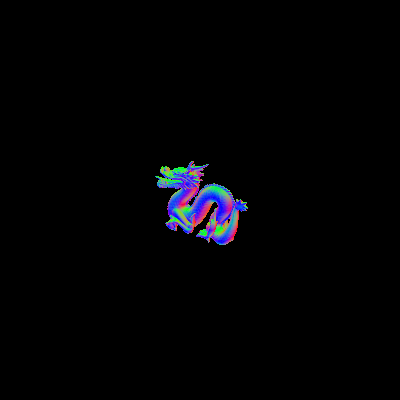

# Transform Fit OBJ
Transforms an OBJ file to fit within the 2x2x2 culling cube.

`npm install -g transform-fit-obj`

`Usage: transform-fit-obj index.js input_file output_file`

Before:


```
transform-fit-obj dragon.obj dragon2.obj
Before transforming
x: -7.0467 <---> 7.0467
y: 0 <---> 9.9399
z: -3.1513 <---> 3.1513

The mesh vertices can be translated by:
[ 0, -4.96995, 0 ]

The mesh vertices can be scaled by:
[ 0.14191039777484496, 0.2012092676988702, 0.3173293561387364 ]

The mesh will be scaled by:
[ 0.14191039777484496, 0.14191039777484496, 0.14191039777484496 ]

After transforming
x: -1 <---> 1
y: -0.7052875814210907 <---> 0.7052875814210907
z: -0.44720223650786894 <---> 0.44720223650786894
Saved transformed mesh to dragon2.obj
```

After:



```
transform-fit-obj dragon2.obj dragon3.obj
Before transforming
x: -1 <---> 1
y: -0.7052875814210907 <---> 0.7052875814210907
z: -0.44720223650786894 <---> 0.44720223650786894
no transforming needed
```

